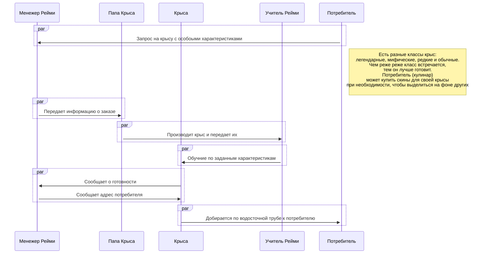

# Крысиный Amazon по мотивам мультфильма "Рататуй"

## Акторы:

1. Менежер Рейми *(МР)*
2. Папа Крыса *(ПК)*
3. Крыса *(К)*
4. Учитель Рейми *(Р)*
5. Потребитель *(П)*

## Диаграмма последовательности:

        
    
    
    
        
        
